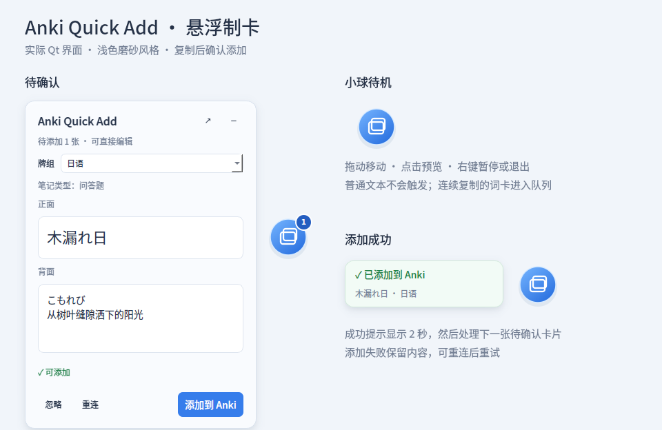

# Anki Quick Add

Anki Quick Add 是一个面向外语学习的 LLM 查词与 Anki 制卡工具，主要解决三个问题：传统手段查词步骤多、速度慢；查到内容后还要手动整理格式再制成 Anki 卡片；通用 LLM 的查询范围和回答侧重不固定，容易出现信息过多、过少或不符合个人学习习惯。

本工具的功能包括：使用可自定义的提示词规定 LLM 的查询方式、解释深度和制卡格式，再将结果快速检查、修改、查重并加入 Anki。

> Anki Quick Add 是独立第三方项目，与 Anki 或 Ankitects 无隶属关系，也未获得其官方认可。

## 主要功能

- 粘贴卡片 JSON 后自动解析正面和背面。
- 加入前可以直接修改卡片内容。
- 自动连接 Anki，并检查是否已有重复卡片。
- 可以直接选择要加入的 Anki 牌组。
- 添加成功后自动清空，方便继续处理下一张卡片。
- 内置日语字词与句子查询提示词，可以一键复制给 LLM。
- 提示词可以自行修改，也可以恢复默认内容。
- Anki 未连接时仍然可以粘贴、查看和编辑卡片。
- 浅色悬浮球常驻其他窗口上方，后台识别剪贴板中的词卡 JSON。
- 连续复制的词卡依次排队，确认后添加；成功提示自动收起，失败保留内容。

## 使用方法

1. 安装并打开 Anki。
2. 在 Anki 中安装 **AnkiConnect** 插件：打开 工具 → 插件 → 获取插件，输入插件代码 2055492159，安装完成后重启 Anki。Anki Quick Add 会通过 AnkiConnect 与本机 Anki 通信。
3. 从 [GitHub Releases](../../releases) 下载 Windows 发布包 `AnkiQuickAdd-Windows.zip`，完整解压后运行：

```text
AnkiQuickAdd/AnkiQuickAdd.exe
```

   不要只把 EXE 单独复制出来；Qt/PySide6 运行库位于同一目录下的 `_internal` 文件夹中。

4. 点击右上角「制卡提示词」，复制提示词给使用的语言模型。
5. 将 LLM 返回的卡片 JSON 粘贴到「制卡内容」。
6. 检查或修改正面、背面。
7. 选择牌组，然后点击「加入 Anki」。

## 卡片格式

最基本的格式：

```json
{
  "front": "単語",
  "back": "假名：たんご\n词性：名词\n释义：单词；词语"
}
```

程序只使用 `front` 和 `back` 两个字段。

## 悬浮制卡

主窗口右上角点击「悬浮制卡」，窗口收起为可拖动的小球。在 ChatGPT 或其他应用复制符合上述格式的 JSON，预览会自动出现，并且不会抢走当前应用的输入焦点。

- 小球角标显示待添加数量；重复的剪贴板内容不会反复入队。
- 在预览中检查或直接编辑正面、背面，选择牌组，再点击「添加到 Anki」。仅在确认后提交。
- 成功后显示「已添加到 Anki」约 2 秒，然后显示下一张待确认卡片。查重发现已有卡片时不会提交。
- Anki 未连接或添加失败时保留内容。点击「重连」或「重试连接」，查重通过后再次确认添加。
- 点击小球或预览右上角「−」可收起预览。点击「↗」返回主窗口；编辑内容和牌组保持同步，返回主窗口后停止后台监听。
- 右键小球可以打开主窗口、暂停/恢复监听或退出。退出会丢弃尚未添加的卡片；本版本的队列保存在当前会话中。
- 笔记类型使用现有 `config.json` 配置，此版本仍处理 `front/back` 两个字段。

源码运行时可直接进入悬浮模式：

```powershell
python app.py --floating
```




## 运行要求

- Windows
- Anki
- AnkiConnect

Windows 发布包已经包含 Python、PySide6 和 Qt 运行时，不需要另外安装 Python 或 Qt。


## 从源码运行

需要 Python 3.12。

```powershell
python -m pip install -r requirements.txt
python app.py
```

悬浮窗行为验证（使用模拟 Anki，不写入真实卡片）：

```powershell
python tools/verify_runtime_behavior.py
python tools/verify_floating_behavior.py
python tools/capture_floating_ui.py
```

如需构建 Windows 发布包：

```powershell
python -m pip install -r requirements-build.txt
pwsh -NoProfile -File tools/build_windows.ps1
```

## 许可证

Anki Quick Add 源码使用 MIT License。Windows 发布包包含 PySide6、Qt、Python、OpenSSL、PyInstaller bootloader 以及开源字体，它们分别遵循各自的许可证。详见 `THIRD_PARTY_NOTICES.md` 和 `licenses/`。
